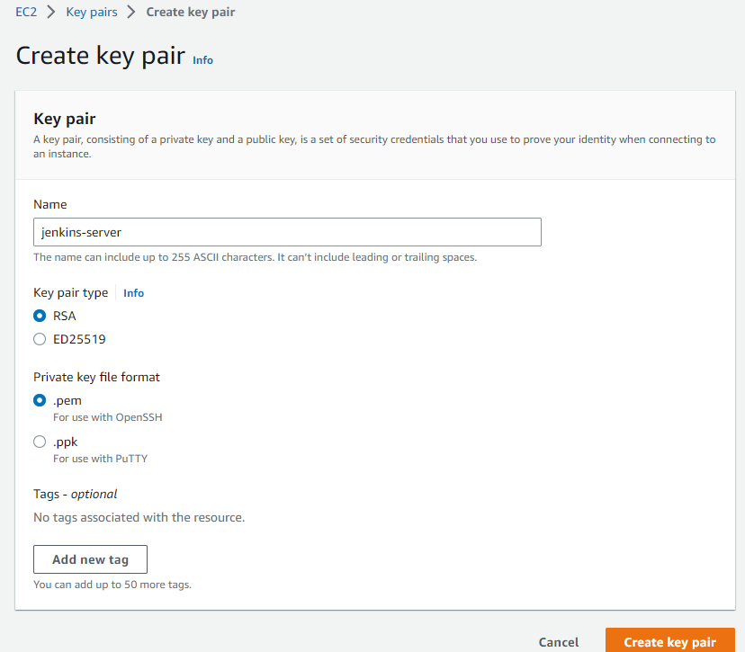
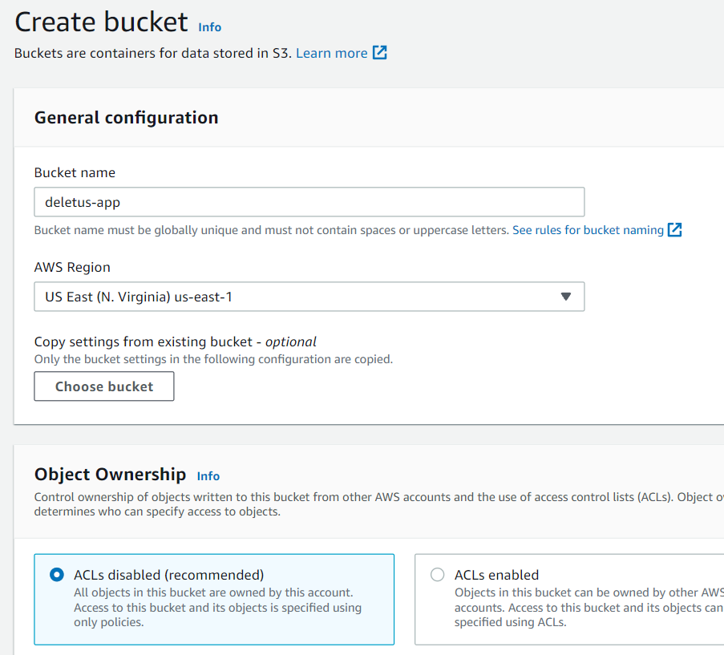
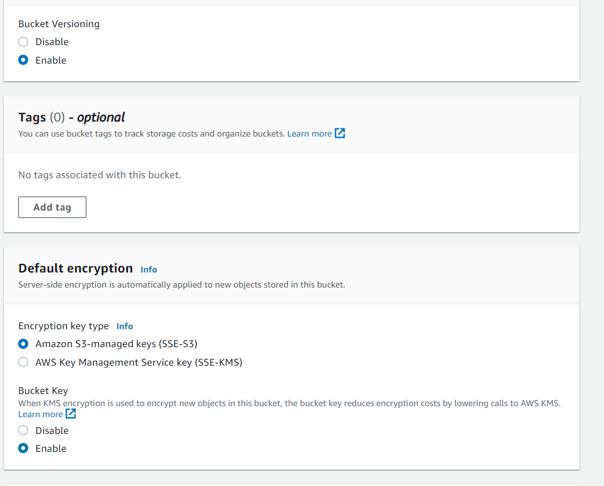

Our aim here is to use a CI/CD pipeline to deploy a Kubernetes container running Nginx, using EKS ,Jenkins and Terraform

We shall create a Jenkins Server and run a jenkins pipeline to create the cluster, deployments and services.

## 1. Let us set up the backend to host our terraform state in the cloud

### Create a keypair jenkins-server



#### We shall create S3 bucket called deletus-app in the console and then define it in our terraform code





#### Next , we shall prepare the terraform files to provision our infrastructure
Create backend.tf
```
touch backend.tf
```

```
terraform {
  backend "s3" {
    bucket = "deletus-app"
    key    = "jenkins-server/terraform.tfstate"
    region = "us-east-1"
  }
  }
```


#### Don't forget to include a .gitignore file to avoid pushing our sensitive files to our git repository

```
# Local .terraform directories
**/.terraform/*

# .tfstate files
*.tfstate
*.tfstate.*

# Crash log files
crash.log
crash.*.log

# Exclude all .tfvars files, which are likely to contain sensitive data, such as
# password, private keys, and other secrets. These should not be part of version 
# control as they are data points which are potentially sensitive and subject 
# to change depending on the environment.
*.tfvars
*.tfvars.json

# Ignore override files as they are usually used to override resources locally and so
# are not checked in
override.tf
override.tf.json
*_override.tf
*_override.tf.json

# Include override files you do wish to add to version control using negated pattern
# !example_override.tf

# Include tfplan files to ignore the plan output of command: terraform plan -out=tfplan
# example: *tfplan*

# Ignore CLI configuration files
.terraformrc
terraform.rc
```

## 2.  Prepare the Jenkins Server using terraform and a userdata script(EC2)
```
touch jenkins-server.tf
```
## 
```

data "aws_ami" "latest-amazon-linux-image" {
  most_recent = true
  owners      = ["amazon"]
  filter {
    name   = "name"
    values = ["amzn2-ami-hvm-*-x86_64-gp2"]
  }
  filter {
    name   = "virtualization-type"
    values = ["hvm"]
  }
}
```
### provision ec2 with latest amzn2-ami-hvm-*-x86_64-gp2 image
```
resource "aws_instance" "myapp-server" {
  ami                         = data.aws_ami.latest-amazon-linux-image.id
  instance_type               = var.instance_type
  key_name                    = "jenkins-server"
  subnet_id                   = aws_subnet.myapp-subnet-1.id
  vpc_security_group_ids      = [aws_default_security_group.default-sg.id]
  availability_zone           = var.avail_zone
  associate_public_ip_address = true
  user_data                   = file("jenkins-userdata.sh")
  tags = {
    Name = "${var.env_prefix}-server"
  }
}

```
### Create userdata script for jenkins instance
### This will install jenkins, git, java, terraform, and kubectl

```
#!/bin/bash

# install jenkins 

sudo yum update
sudo wget -O /etc/yum.repos.d/jenkins.repo \
    https://pkg.jenkins.io/redhat-stable/jenkins.repo
sudo rpm --import https://pkg.jenkins.io/redhat-stable/jenkins.io.key
sudo yum upgrade -y
sudo amazon-linux-extras install java-openjdk11 -y
sudo yum install jenkins -y
sudo systemctl enable jenkins
sudo systemctl start jenkins

# install git
sudo yum install git -y

# install terraform

sudo yum install -y yum-utils
sudo yum-config-manager --add-repo https://rpm.releases.hashicorp.com/AmazonLinux/hashicorp.repo
sudo yum -y install terraform

# install kubectl

sudo curl -LO https://storage.googleapis.com/kubernetes-release/release/v1.23.6/bin/linux/amd64/kubectl
sudo chmod +x ./kubectl
sudo mkdir -p $HOME/bin && sudo cp ./kubectl $HOME/bin/kubectl && export PATH=$PATH:$HOME/bin

```

### We will create outputs.tf to output the public ip address of our jenkins server

```
output "ec2_public_ip" {
  value = aws_instance.myapp-server.public_ip
}
```

### Our providers will be in provider.tf
### This will be aws in this case
```
terraform {
  required_providers {
    aws = {
      source  = "hashicorp/aws"
      version = "~> 4.0"
    }
  }
}

# Configure the AWS Provider
provider "aws" {
  region = "us-east-1"
}
```

### Let's create the vpc, public subnet, route table and internet gateway

```
resource "aws_vpc" "myapp-vpc" {
  cidr_block = var.vpc_cidr_block
  tags = {
    Name = "${var.env_prefix}-vpc"
  }
}

resource "aws_subnet" "myapp-subnet-1" {
  vpc_id            = aws_vpc.myapp-vpc.id
  cidr_block        = var.subnet_cidr_block
  availability_zone = var.avail_zone
  tags = {
    Name = "${var.env_prefix}-subnet-1"
  }
}

resource "aws_internet_gateway" "myapp-igw" {
  vpc_id = aws_vpc.myapp-vpc.id
  tags = {
    Name = "${var.env_prefix}-igw"
  }
}

resource "aws_default_route_table" "main-rtb" {
  default_route_table_id = aws_vpc.myapp-vpc.default_route_table_id
  route {
    cidr_block = "0.0.0.0/0"
    gateway_id = aws_internet_gateway.myapp-igw.id
  }
  tags = {
    Name = "${var.env_prefix}-main-rtb"
  }
}

resource "aws_default_security_group" "default-sg" {
  vpc_id = aws_vpc.myapp-vpc.id
  ingress {
    from_port   = 22
    to_port     = 22
    protocol    = "tcp"
    cidr_blocks = ["0.0.0.0/0"]
  }
  ingress {
    from_port   = 8080
    to_port     = 8080
    protocol    = "tcp"
    cidr_blocks = ["0.0.0.0/0"]
  }
  egress {
    from_port   = 0
    to_port     = 0
    protocol    = "-1"
    cidr_blocks = ["0.0.0.0/0"]
  }
  tags = {
    Name = "${var.env_prefix}-default-sg"
  }
}
```

### Next, we shall declare our variables in variables.tf

```
variable "avail_zone" {
  description = ""
  type = "string"
  default=""
}

variable "subnet_cidr_block " {
  description = "cidr block for the vpc"
  type = ""
  default="10.0.1.0/24"
}

variable "vpc_cidr_block " {
  description = "cidr block for the subnet"
  type = ""
  default="10.0.0.0/16"
}

variable " env_prefix" {
  description = "string"
  type = "dev"
  default=""
}

variable " instance_type" {
  description = "string"
  type = ""
  default="t2.micro"
}
```

#### Next, we shall assign values to the variables in terraform.tfvars

```
vpc_cidr_block      = "10.0.0.0/16"
subnet_cidr_block   = "10.0.10.0/24"
avail_zone          = "us-east-1a"
env_prefix          = "dev"
instance_type       = "t2.small"
```
#### End of variable declaration